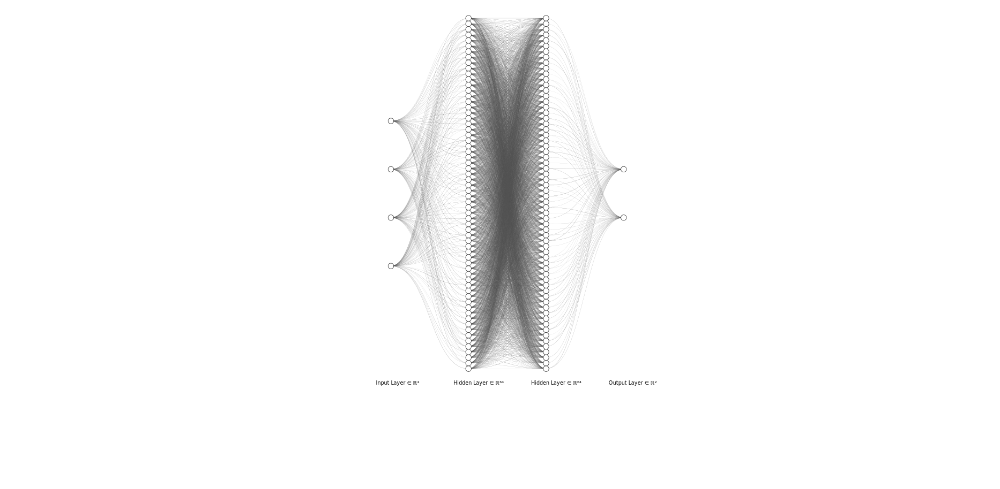

# Deep Q-Network - Cartpole Environment

The goal of the project is to implement a Deep Q-Network approach to the Cartpole Environment implementation provided in the Gymnasium Library 
[[1]](https://github.com/Farama-Foundation/Gymnasium)
[[2]](https://www.gymlibrary.dev/environments/classic_control/cart_pole/) .

## Environment 

The environment was first described by Barto, Sutton and Anderson in [[3]](https://ieeexplore.ieee.org/document/6313077).
Here, a pole is attached by an un-actuated joint to a cart, which moves along a frictionless track.
The pendulum is placed upright on the cart and the goal is to balance the pole by applying forces in the left and right direction on the cart.

### Action space 

The action space is ${0, 1}$, where $0$ means push the cart to the left while $1$ means push the cart to the right.

### State space 

The state consists of 4 variables, namely

-   $\xi \rightarrow$ the cart position, with values in the interval $[-4.8, 4.8]$ 

    An episode ends if $\xi_x$ leaves the interval $(-2.4, 2.4)$.

-   $\vec{\xi} \rightarrow$ the cart velocity, with values in the interval $(-\infty, \infty)$.

-   $\theta \rightarrow$ the pole angle, with values in the interval $[-24\degree, 24\degree]$.

    An episode ends if the angle leaves the interval $(-12\degree, 12\degree)$.

-   $\vec{\theta} \rightarrow$ the pole angular velocity, with values in the interval $(-\infty, \infty)$.

The start state $s_0$ is set initially to a uniform random value $\mathcal{X} \in (-0.05, 0.05)$ for all 4 variables.

The end state is either one of the aforementioned conditions or if the episode length is greather than 500.

### Reward

A reward of $+1$ is received for every step taken, including the termination step, as we want to keep the pole upright for as long as possible.

## Agent

### Policies

## Model

To define the model, pytorch was used.

### Architecture

Basic architecture generated with [NN-SVG](https://alexlenail.me/NN-SVG/LeNet.html).




# Usage 

The conda environment used for the development of this project can be installed by using the following command:

```{sh}
conda env create -f environment.yml
conda activate rl
```